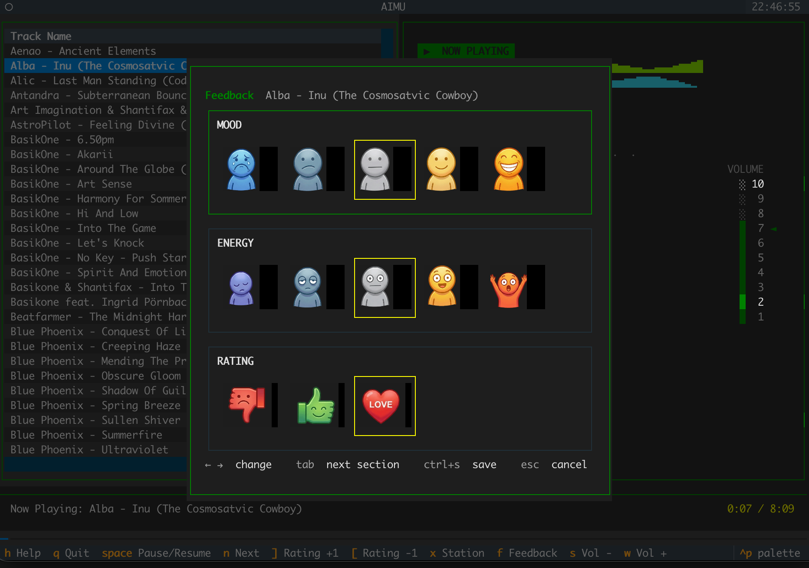
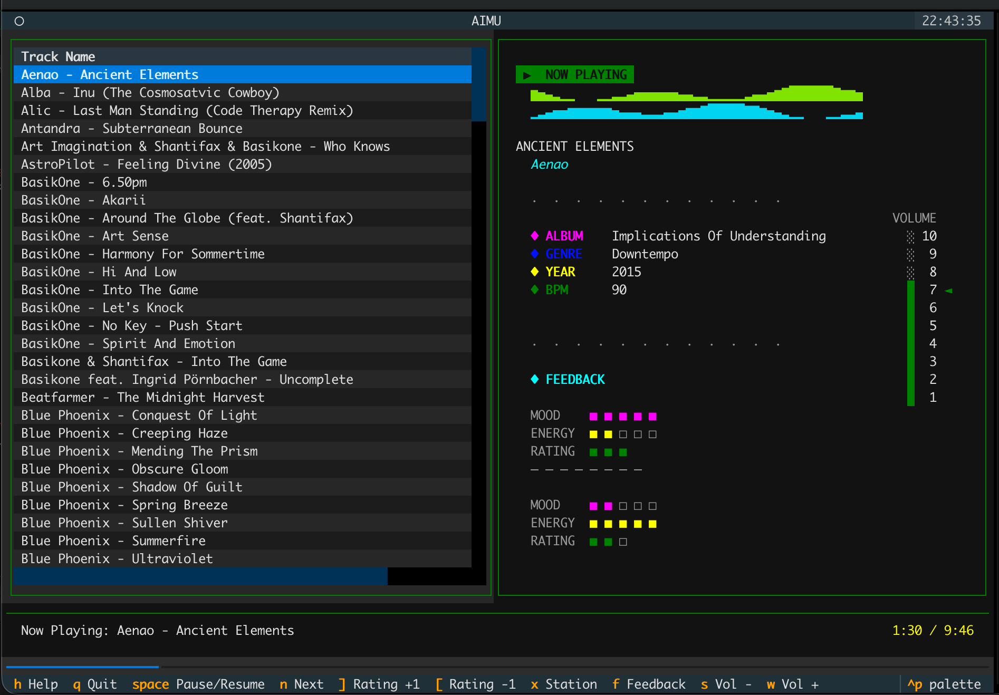
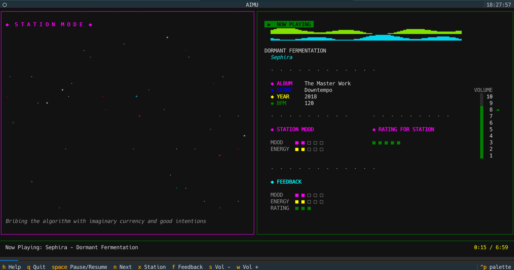

# AIMU — AI Music Player

A terminal-based music player that learns your taste. Browse your MP3 library, listen to tracks, and give feedback — mood, energy, and rating — that will be used by AI to recommend music tailored to you.

Built with [Textual](https://github.com/Textualize/textual), [python-vlc](https://github.com/oaubert/python-vlc), and SQLite.



## Core Feature: Feedback

Every time you listen to a track, you can rate it across three dimensions:

- **Mood** (1–5) — how happy / pleasant the track feels
- **Energy** (1–5) — how energetic / arousing the track feels
- **Rating** (1–3) — your overall preference

Feedback is stored as an append-only log: every submission creates a new record, so your history of impressions is preserved. The info panel displays all past feedback entries for the selected track as visual square indicators.



This data is designed to feed into an AI recommendation engine, giving it a rich signal of how your perception of a track changes over time.

## Station Mode

An ambient auto-play mode that picks tracks randomly, weighted by your ratings — higher-rated songs play more often. A particle field animation accompanies playback.



## Requirements

- Python 3.10+
- [VLC Media Player](https://www.videolan.org/vlc/)

```bash
# macOS
brew install --cask vlc
```

## Installation

```bash
git clone https://github.com/nerijus-areska/aimu.git
cd aimu

python3 -m venv venv
source venv/bin/activate

pip install -r requirements.txt
```

## Usage

### 1. Scan your music library

```bash
python scan_mp3_to_db.py /path/to/your/music
```

This recursively finds all MP3 files and stores their metadata in a local SQLite database (`music.db`).

| Flag | Description |
|------|-------------|
| `--db-path PATH` | Custom database file location |
| `--rating N` | Default rating (0–5) for new tracks |
| `--no-metadata` | Skip reading ID3 tags |

### 2. Launch the player

```bash
python main.py
```

## Keybindings

| Key | Action |
|-----|--------|
| `Enter` | Play selected track |
| `Space` | Pause / Resume |
| `N` | Next track |
| `W` / `S` | Volume up / down |
| `Left` / `Right` | Seek -/+ 10 seconds |
| `F` | Open feedback modal |
| `X` | Toggle station mode |
| `H` | Help overlay |
| `Q` | Quit |

Keybindings are customizable via `keybindings.json`.

## License

MIT
